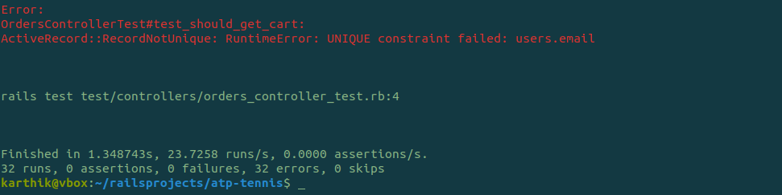
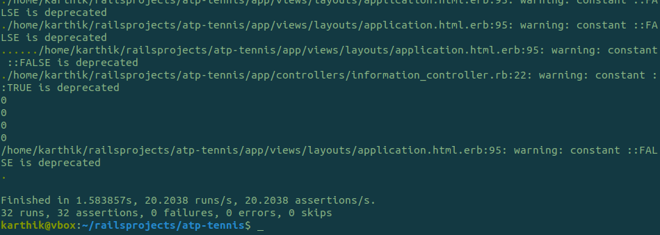
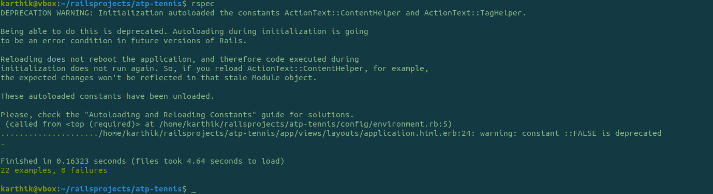
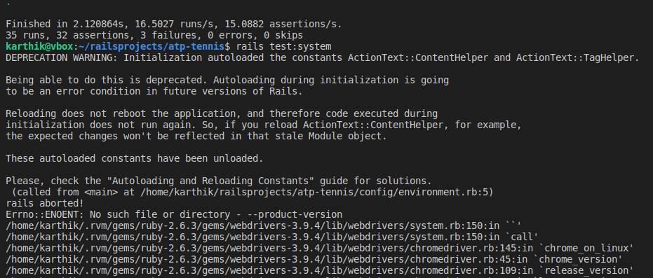

# ACES 
**The project is avaliable via the link: https://hidden-citadel-87421.herokuapp.com/**
* Sorry Heroku deployment taken down

**Login Credentials

  * Admin User:
    * admin@tennis.com /admin123
    * admin2@tennis.com /admin123
    
  * Test User
    * testuser@tennis.com /123456

**Only 'authenticated users' can orders the products.** 

**Guest Users can view other open data features like - Playes, Matchstats and Products **

**Admins can view the dashboard (sales, analysis, users, orders, inverntory), controls(view/edit/ data of the application) **

*ACES project was developed as a part of MSc Information Technology course as a scope of a bigger project in order to demonstrate team skills, technology and its potential implementation. The idea was inspired by the dataset found in Kaggle: to gather stats of last 3 years (2017 -2019) ATP Tennis Grand Slams of Men Single Category, where it will be regularly updated from its sources and provide the users with free data visualization and match comparisons. The project also consists of a shopping cart where the users can buy products related to Tennis.*

## The Context and DataSet Sources:
The datasets were chosen for the database: ATP Tennis Grand Slams for last three years. This dataset is a huge collection of many datasets hence, a good chunk of it taken for this project which has four different tables (small datasets), all linked together. https://www.kaggle.com/tbrownlow3/atp-tennis

Due to the huge size of the datasets all together and limitations of this project (time constraints, tasks constraints, aimed to created the database to produce the scope of the dataset given as a demonstration of future potential of the application. Full datasets are available via the links above. 


## Developeloped Features:

* Home Page: View all the available products
* Players: View list of all available players and individual profiles
* Grand Slams: View list of matches between 2017 -2019 and view the match stats with players Head to Head comparision
* Cart: View products added to the Cart
* Admin Control: View the products related stats and graphs
* Admin Dashboard: View, edit and delete  database deatils

## TARGET USERS:
The project was designed for sports enthusiastic, students and reporters.

### Top-level User stories:
* A User should be able to access the web app from different devices via the link: 
                https://hidden-citadel-87421.herokuapp.com/
* A User should be able to navigate easily through responsive menu and Cart.
* A User should be able to access open source and live data displayed on the website.
* A User should be able to view match stats in charts and download the open data available.
* A User should be able to add products to cart to buy
* Admin can view the user orders, edit user details and add/remove products

## Ruby version

```ruby 2.6.3p62 (2019-04-16 revision 67580) [x86_64-darwin18]```

```Rails 6.0.0```

**System dependencies:**

*file: package.json. Node dependencies:*

    "@rails/actioncable": "^6.0.0",
    "@rails/activestorage": "^6.0.0",
    "@rails/ujs": "^6.0.0",
    "@rails/webpacker": "^4.2.0",
    "bootstrap": "4.3.1",
    "chart.js": "^2.9.3",
    "chartkick": "^3.2.0",
    "highcharts": "^8.0.0",
    "jquery": "^3.4.1",
    "popper.js": "^1.16.0",
    "turbolinks": "^5.2.0"
  
*file: Gemfile. Node dependencies:*

Bundle edge Rails instead: gem 'rails', github: 'rails/rails'
    ```gem 'rails', '~> 6.0.0'```

Use Puma as the app server
    ```gem 'puma', '~> 3.11'```

Use SCSS for stylesheets
    ```gem 'sass-rails', '~> 5'```

Transpile app-like JavaScript. Read more: https://github.com/rails/webpacker
    ```gem 'webpacker', '~> 4.0'```

Turbolinks makes navigating your web application faster. Read more: https://github.com/turbolinks/turbolinks
    ```gem 'turbolinks', '~> 5'```

Build JSON APIs with ease. Read more: https://github.com/rails/jbuilder
    ```gem 'jbuilder', '~> 2.7'```

This gem provides jQuery and the jQuery-ujs driver for your Rails 4+ application.
    ```gem 'jquery-rails', '~> 4.3', '>= 4.3.5'```

Windows does not include zoneinfo files, so bundle the tzinfo-data gem
    ```gem 'tzinfo-data', platforms: [:mingw, :mswin, :x64_mingw, :jruby]```

A Sass-powered version of Bootstrap 3, ready to drop right into your Sass powered applications.
    ```gem 'bootstrap-sass'```

Gem that includes Highcharts (Interactive JavaScript charts for your web projects)
    ```gem 'highcharts-rails', '~> 6.0', '>= 6.0.3'```

Gem for consuming restful web services dead easy
    ```gem 'httparty', '~> 0.17.1'```

A library for the Guardian Content AP
    ```gem 'guardian-content', '~> 0.2.2'```

Use Active Model has_secure_password
    ```gem 'bcrypt', '~> 3.1.7'```

Flexible authentication solution for Rails with Warden
    ```gem 'devise', '~> 4.2'```

Reduces boot times through caching; required in config/boot.rb
    ```gem 'bootsnap', '>= 1.4.2', require: false```

The CSV library provides a complete interface to CSV files and data. I
    ```gem 'csv', '~> 0.0.1'```
    ```gem 'sprockets-rails', require: 'sprockets/railtie'```

ChartKick foreasy Charts
    ```gem "chartkick"```

RailsAdmin is a Rails engine that provides an easy-to-use interface for managing your data.
    ```gem 'rails_admin', '~> 2.0'```

Font-Awesome SASS gem for use in Ruby projects
    ```gem 'font-awesome-sass', '~> 5.11', '>= 5.11.2'```

gem Uglifier minifies JavaScript files by wrapping UglifyJS to be accessible in Ruby
    ```gem 'uglifier', '~> 4.2'```

## Installation & Configuration

1. Clone, Fork or download the code package from the master branch https://github.com/t17sk18/atp-tennis.git
2. Install Ruby, Rails and gems mentioned above. You might also need to install Bundle, NPM, and Yarn 
3. In the code directory run the folllowing commands:

```yarn install --check-files```

```bundle update```

**for database initialisation & configuration**

```rake db:migrate```

```rails generate model isocode isocode:string country:string```

```rails generate scaffold  matchstat statId:integer matchId:string playerId:string points:integer rank:integer winner:boolean sets:integer set1:integer set2:integer set3:integer set4:integer set5:integer avg_odds:float max_odds:float total_pts:integer serve_pt:integer return_pt:integer aces:integer bp_saved:integer bp_faced:integer first_serve_rtn_won:integer second_serve_rtn_won:integer first_serve_in:integer dbl_faults:integer first_server_per:float player:references match:references```

```rails generate scaffold player playerId:string name:string hand:string country:string birthday:string isocode:references```

```rails generate model match matchId:string round:string date:date avg_min_game:float avg_seconds_point:float avg_minutes_set:float tournament:string year:integer match_minutes:integer```

```rails generate model cart cartId:integer email:string productId:integer quantity:integer price:float purchaseStatus:boolean user:references product:references```

```rails generate model order orderId:integer userEmail:string productsList:string shippingAddress:string orderDate:datetime ```

**for Seeding Data from CSV **

```rake isocode:seed_isocode```

```rake player:seed_player```

```rake match:seed_match```

```rake matchstat:seed_matchstat```

```rake product:seed_product```

**supporting gems for application:**

```gem install highcharts-rails ```

```npm install bootstrap@3```

```yarn add highcharts ```

```yarn add jquery ```

```sudo apt-get install libpq-dev or sudo apt-get install postgresql```

```yarn add chartkick chart.js```

## Executing the application locally

* To run on the local/Development environment: ```rails server``` or ```rails s``` from the project directory

## Authentication

For the authentication and authorization, a login portal was created and integrated with Device and Admin Gems. Logged in users can buy products and have extra privileges. Admin user can monitor the entire application with dashboard feature. Even the logged users cant access admin previliges by guessing the url.

Flexible authentication solution for Rails with Warden
    ```gem 'devise', '~> 4.2'```

RailsAdmin is a Rails engine that provides an easy-to-use interface for managing your data.
    ```gem 'rails_admin', '~> 2.0'```
    
 ** Non authenticated users cannot order the products. **
 
 * Guest Users will be redired to login page for authentication page to add to cart, view cart, modify cart and checkout

## Testing
The testing was executed using default unit tests with addition tests for main funtionality. 
Testing framework - Unit Tests: Default + New Tests in total - Fixed all 35 failed unit tests. 

* To run the tests <App Folder Path>$    rails test
 

 


Tried the other test frameworks like Rspec to execute tests and successfully passed 22 test out of 24. Though it was not complete test suites, this could be done as time permits in future. 

 BDD for Rails
  
 ```gem 'rspec-rails'```

* To run the tests <App Folder Path>$    rspec

Cucumber Generator and Runtime for Rails

```gem 'cucumber-rails', '~> 2.0'```



## Failed System Testing
There was an internal Rails framwork issue that stopped me from running system test. Here is the Screen shot for the issue




## Production Deployment: Heroku

_follow the instructions on the link below:_
https://devcenter.heroku.com/articles/getting-started-with-rails5

Heroku for deployment of the application. Heroku required PostgreSQL as a database adapter for deployment, so it has been switching throughout the project.

_in database.yml change production database adapter from sqlite3 to postgresql as mentioned in the file_


**Admin Previliges ** 

Only Application DBA can update the admin rights 

* update users SET admin = TRUE WHERE email = 'USEREMAIL';


## Future potential
This project can be used as a starting point for further enhancement of the application in aspects of more security, admin dashboard and more visualization. By embedding more open data and products to the database in the future, sales analysis, likes, wish lists and product reviews could be implemented. Security can enhance for better reliability. More vigorous testing would be advisable for bug-free application. 
